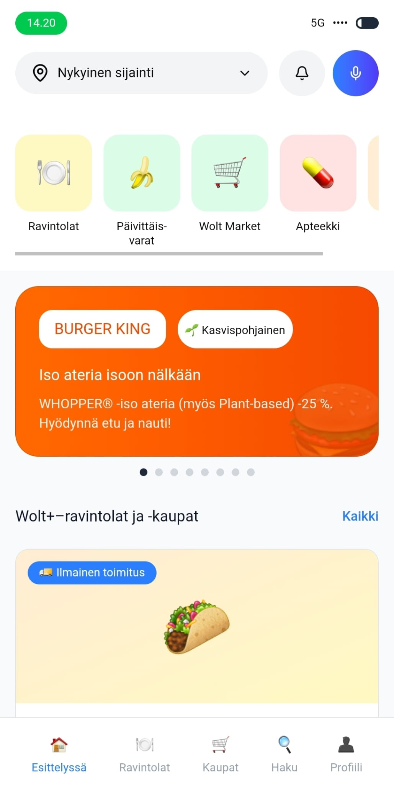
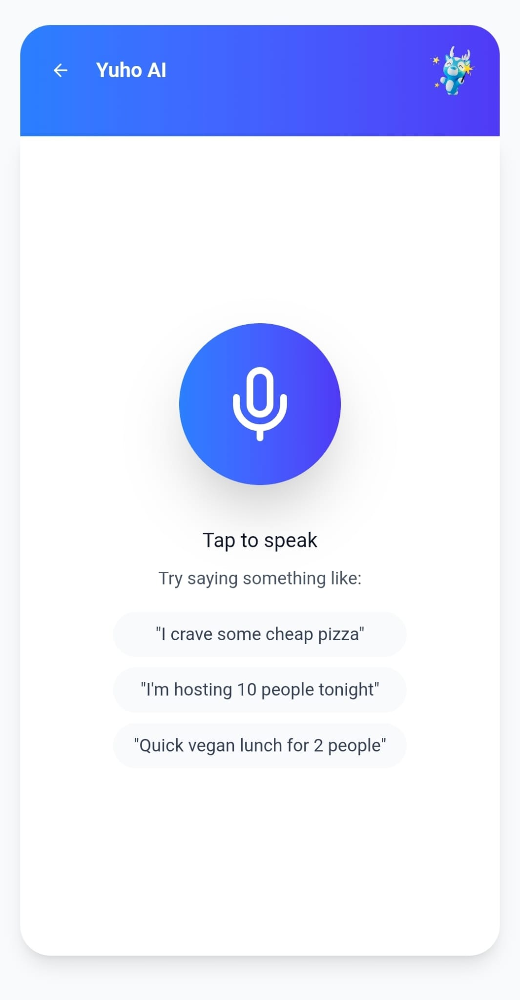
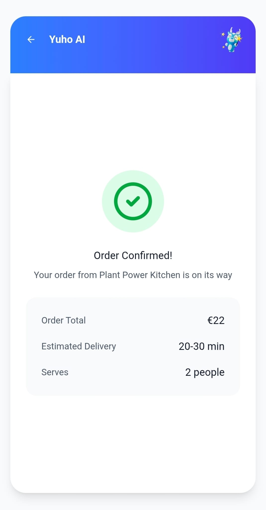
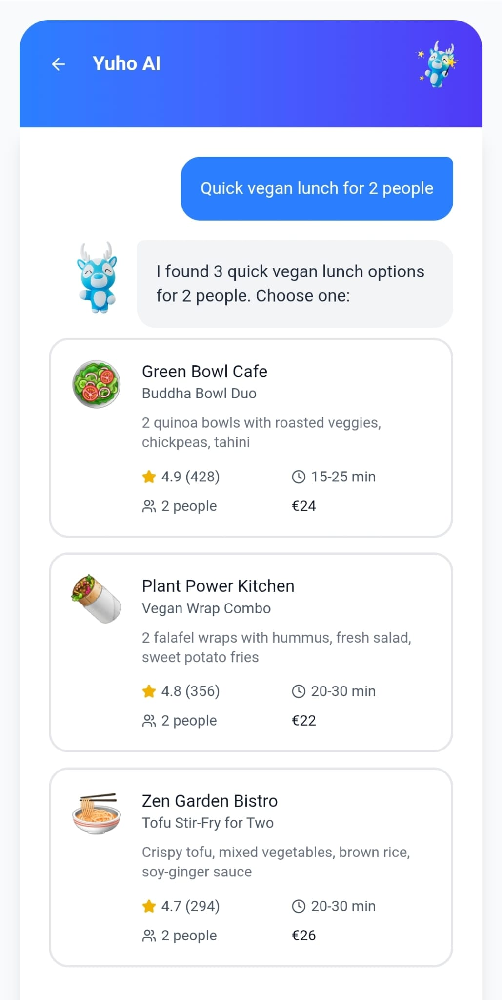

# 🚀 AI Voice Assistant Integration for Wolt

Enhance the Wolt user experience with natural-language voice interaction.
This project integrates an **AI-powered voice assistant** into the Wolt app (or Wolt-like mock UI), enabling users to **search restaurants, order food, navigate the app, and interact with content using voice commands**.  
Demo version avalable here -> https://junction-challenge.vercel.app/

---

## 🎯 Features

### 🎙️ Voice Interaction

* Record user speech directly in app (browser in demo version)
* Transcribe audio using AI (e.g., Whisper, Deepgram, or built-in STT)
* Process natural-language intent with an LLM
* Respond using on-screen text and optional text-to-speech

### 🍽️ Wolt-Like UI Integration

* Works on top of a simulated Wolt-style interface
* Supports search flows such as:

  * “Find sushi places nearby”
  * “Show me vegetarian burgers”
  * “Open the cart”
  * “Track my order”

### 🧩 Modular Components

* **Voice recorder**
* **Transcription handler**
* **LLM request module**
* **UI command interpreter**
* **Response renderer**

### ⚡ Built With

* **Vite + React + TypeScript**
* **Web Audio API** for recording
* **OpenAI / custom LLM API** for reasoning
* **Tailwind or CSS modules** for styling (depending on project)

---

## 📂 Project Structure

```
ai-assistant-wolt/
│
├── src/
│   ├── App.tsx               # Main UI + assistant logic
│   ├── main.tsx              # React entry point
│   ├── components/           # UI + assistant components
│   ├── assets/               # Icons, audio waves, images
│   ├── styles/               # Global stylesheets
│   ├── guidelines/           # AI behaviour + prompt guidelines
│   ├── Attributions.md       # Credits for assets
│
├── index.html
├── vite.config.ts
├── package.json
└── README.md                 # (This file)
```

---

## 🔧 Installation

### 1. Clone the repository

```bash
git clone https://github.com/<your-username>/<repo-name>.git
cd <repo-name>
```

### 2. Install dependencies

```bash
npm install
```

### 3. Configure environment variables

Create a file named `.env` in the project root:

```
VITE_OPENAI_API_KEY=your_api_key_here
```

(Optional depending on your LLM provider.)

### 4. Start the development server

```bash
npm run dev
```

---

## 🧠 How It Works

### 1. **Voice Capture**

The assistant listens using the Web Audio API.

### 2. **Transcription**

Audio is sent to an STT model for accurate transcription.

### 3. **LLM Reasoning**

The assistant receives the user's words, interprets intent, and turns it into Wolt UI actions.

### 4. **UI Interaction Layer**

Commands are mapped to UI actions:

* Navigate → pages
* Query → restaurant data
* Filter → categories
* Respond → voice or text

Example dialogue:

**User:** “Find a spicy ramen place.”
**Assistant:** Searches for ramen & applies spicy filter.

---

## 🖼️ Screenshots (optional)

<table align="center">
  <tr>
    <td></td>
    <td></td>
  </tr>
  <tr>
    <td></td>
    <td></td>
  </tr>
</table>

---

## 🚢 Deployment

To build for production:

```bash
npm run build
```

Then host `dist/` on:

* Vercel
* Netlify
* Cloudflare Pages
* GitHub Pages

---

## 🧪 Testing (optional section)

You can add Jest, Vitest, or React Testing Library for unit tests.

---

## 🤝 Contributing

Pull requests are welcome. For major changes, please open an issue first to discuss the update.

---

## 📜 License

MIT License.
Feel free to use, modify, and distribute.

  
## AI Assistant Integration

This is a code bundle for AI Assistant Integration. The original project is available at https://www.figma.com/design/QO65lMt9iaB3JTytmYHXb1/AI-Assistant-Integration.

